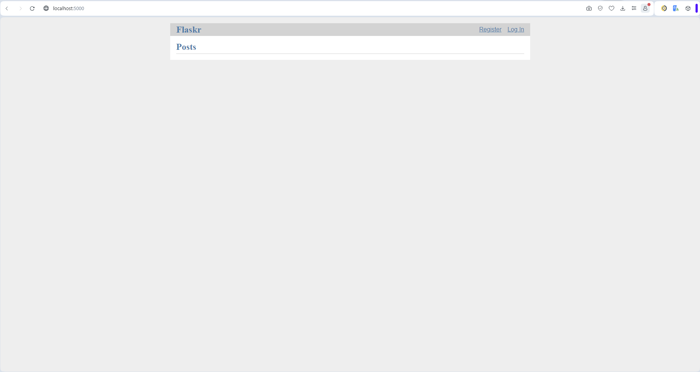
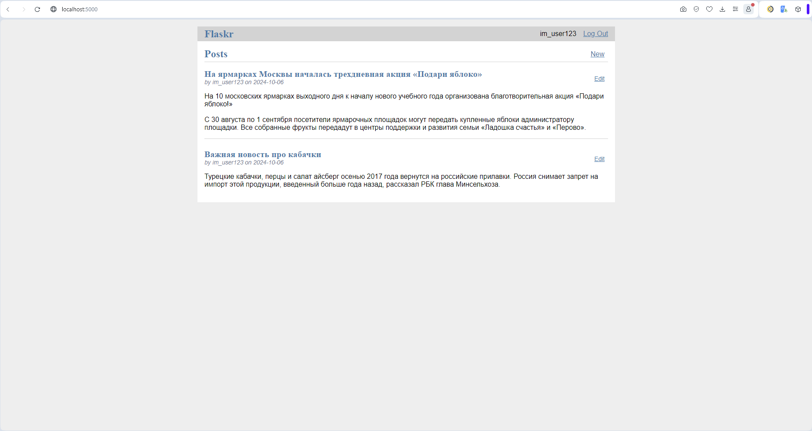
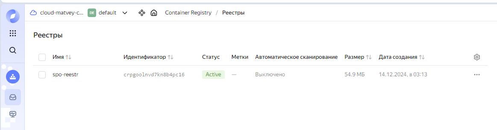
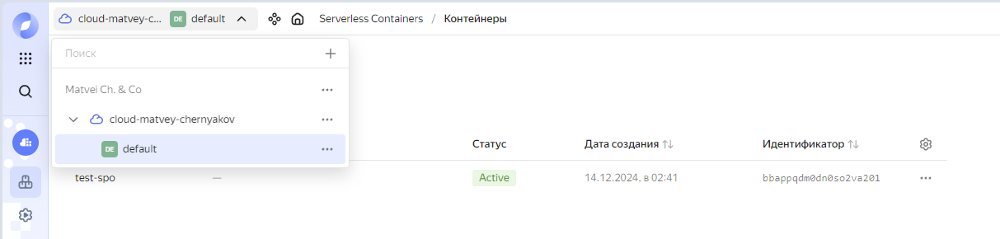
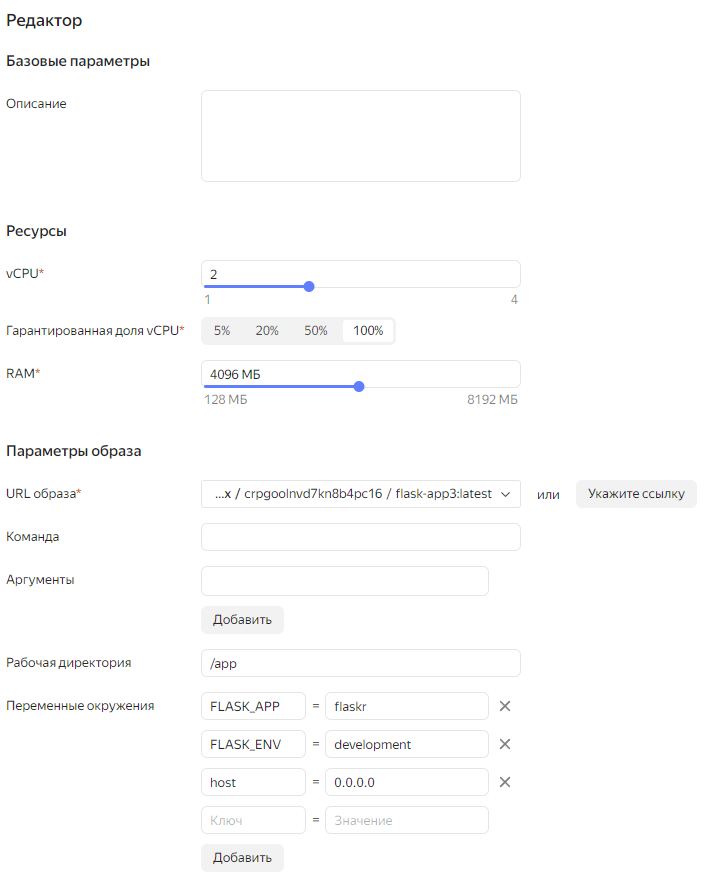
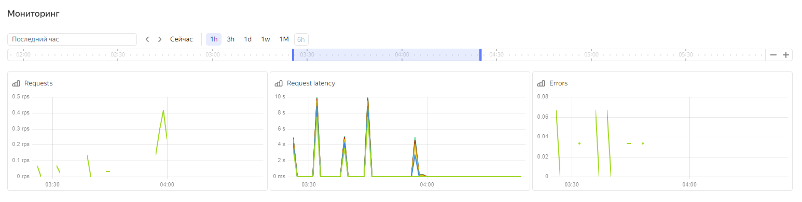
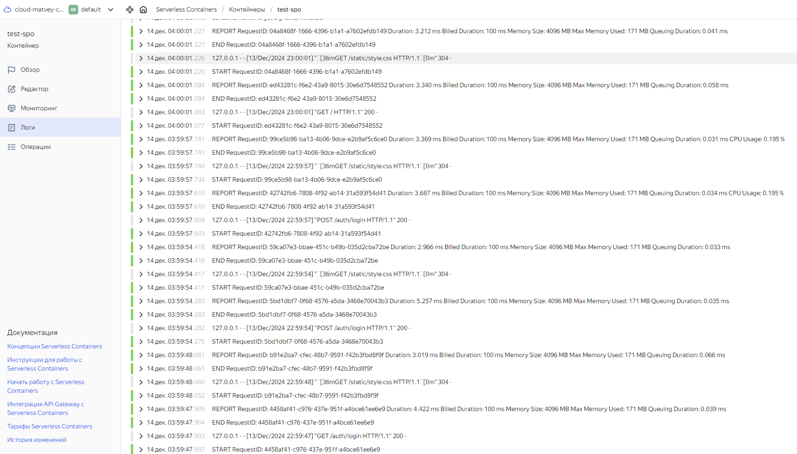
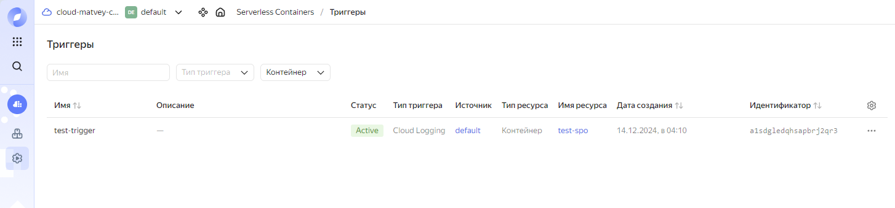
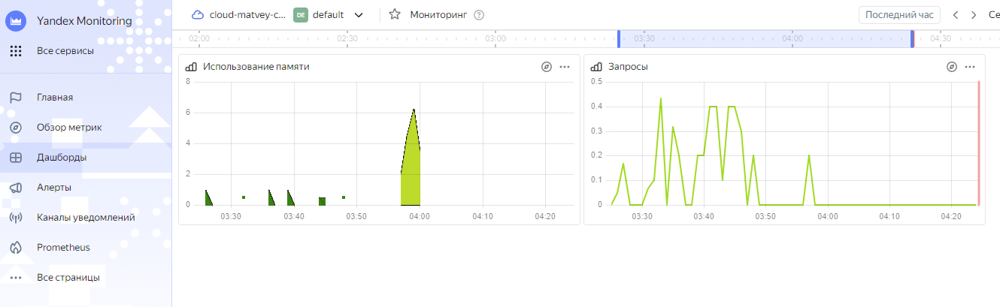

# Домашнее задание №1-3 по дисциплине системное программное обеспечение (DevOps)

## Условие

1. Необходимо найти какое-то приложение (к примеру на github) и проверить работоспособность.
2. Запустить его с помощью Docker.
3. Добавить мониторинг (CPU/RAM/DISC, логгирование, триггеринг и др.)

## Решение

1. Найдем какое-нибудь простое приложение на гите, к примеру официальный репозиторий фреймворка Flask для создания веб-приложений на Python. В репозитории есть папка examples с простыми примерами веб-серверов для запуска и проверки. Создадим проект и клонируем в него репозиторий.

```bash
git clone https://github.com/pallets/flask
```

2. После того как мы клонируем этот репозиторий, добавим Dockerfile для упаковки приложения.

В проекте есть папка examples/tutorial, где хранится проект с минимальным сервером на flask и базой данных sqlite - перейдем в нужную директорию.

```bash
cd flask/examples/tutorial
```

Создадим Dockerfile со следующим содержанием.

```Dockerfile
# Используем базовый образ Python
FROM python:3.9-slim
LABEL authors="mruax"

# Устанавливаем рабочую директорию
WORKDIR /app

# Копируем файл requirements.txt и устанавливаем зависимости
COPY requirements.txt requirements.txt
RUN pip install -r requirements.txt

# Копируем приложение в рабочую директорию
COPY . .

# Устанавливаем переменные окружения для Flask
ENV FLASK_APP=flaskr
ENV FLASK_ENV=development

# Инициализация базы данных
RUN flask --app flaskr init-db

# Запуск сервера
CMD ["flask", "--app", "flaskr", "run", "--host=0.0.0.0"]

# Открываем порт
EXPOSE 5000

```

Также установим зависимости для сборки в файл requirements.txt.

```txt
build==1.2.1
packaging==24.1
pyproject-hooks==1.1.0
click>=8.0.1
Flask>=2.0.1
itsdangerous>=2.0.1
Jinja2>=3.0.1
MarkupSafe>=2.0.1
Werkzeug>=2.0.1
```

3. Создаем контейнер.

```bash
docker build -t flask-app .
```

4. Запускаем контейнер.

Можно в detached режиме, можно без (флаг -d).

```bash
docker run -d -p 5000:5000 flask-app
```

5. Проверим, что все запускается

Перейдем по ссылке - http://localhost:5000



Можно зарегистрироваться и войти в аккаунт. Также можно создавать посты с заголовками и описанием.



## Мониторинг

Будем использовать Yandex Cloud. После создания собственного пространства выполним следующие шаги:

1. Создадим реестр контейнеров



В него мы загрузим наш созданный образ.

2. Создадим контейнер. Укажем переменные окружения и образ из реестра.





Мониторинг



Логирование (внутри есть запросы, память + CPU)



3. Создадим тестовый триггер.



4. Создадим простейший дешборд для мониторинга.



Контейнер сделал публичным - https://bbappqdm0dn0so2va201.containers.yandexcloud.net/

Можно зайти и проверить, постараюсь оставить хост рабочим.

## О работе

Здесь дополнительно можно реализовать docker compose с двумя контейнерами под сервер и бд или проделать аналогичную работу на k8s.

Также можно сделать Grafana + Prometheus + обернуть все в k8s.

Автор: Черняков М. Фт-320008